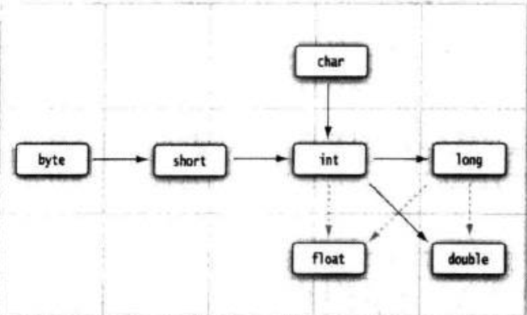

### 第三章 Java 的基本程序设计结构

   
    
#### 3.1 FirstSample 
         
    
#### 3.2 注解

    
#### 3.3 数据类型

##### 3.3.1 整型 
   
|类型|存储需求|取值范围|
|-|-|-|
|int|4个字节|-2147483648 ~ 2147483647（正好超过20亿）|
|short|2个字节|-32768 ~ 32767|
|long|8个字节|-9223372036854775808 ~ 9223372036854775807|
|short|1个字节|-128 ~ 127|
    
    在Java中，整型的范围与运行Java代码的机器无关。
    
    长整形数值有一个后缀L， 十六进制数值有一个前缀0x. 八进制有一个前缀0,X显然八进制表示法比较容易混淆，
    建议最好不要使用八进制常数。 从Java7，加上前缀0b就可以写二进制数。同样从java7 开始，还可以为数字
    字面量加下划线，如：1_000_000 表示一百万。这些下划线只是为了让人更易读。Java编译器会除去这些下划线。
    
##### 3.3.2 浮点类型

|类型|存储需求|取值范围|
|-|-|-|
|float|4个字节|大约 +- 3.40282347E+38F (有效位数为6-7位)|
|double|8个字节|大约 +- 1.79769313486231570E+308 (有效位数为15位)|
    
    绝大多数应用程序都采用double类型，很多情况下，float类型的精度很难满足需求。
    实际上，只有很少的情况适合使用float类型，如：需要快速地处理单精度数据，或需要存储大量数据。
    float类型的数值有一个后缀F。没有后缀F的浮点数值默认为double类型。
    
    表示溢出和出错情况的是三个特殊的浮点数值。
    正无穷大
    负无穷大 
    NaN （不是一个数字）
    
    浮点数值不适用于禁止出现舍入误差的金融计算中。如果需要计算中不包含有任何舍入误差，就应该使用BigDecimal类。
    
##### 3.3.3 char类型
    
    char类型表示单个字符。我们强烈建议不要在程序中使用char类型。
    
    在java中，char类型用UTF-16编码描述一个代码单元。
    
##### 3.3.4 boolean类型    
    
    boolean （布尔）类型有两个值：false和true，用来判定逻辑条件。
    
    
    
#### 3.4 变量

    在Java中， 每一个变量属于一种类型（type）
    
    变量名中所有的字符都是有意义的，并且大小写铭感，变量名的长度没有限制。
    
    尽管$是一个合法的Java字符，但不要在你自己的代码中使用这个字母。它只用在Java编译器或者其他工具生成的名字中。
    

##### 3.4.2 常量

    在Java中，利用关键字final指示常量。
    
    关键字final表示这个变量只能被赋值一次，一旦被赋值之后，就不能再更改了。习惯上，常量名使用大写。
    
    

#### 3.5 运算符
    
    可移植性是JAVA语言的设计目标之一。无论在哪个虚拟机上运行，同一运算应该得到同样的结果。
    对于浮点数的算术运算，实现这样的可移植性是相当困难的。double类型使用64位存储一个double数值，
    而有些处理器使用80位浮点寄存器。执行寄存器增加了中间过程的计算精度。
    
    在默认情况下，虚拟机设计者允许将中间计算结果采用扩展的精度。但是对于使用了strictfp关键字标记的
    方法必须使用严格的浮点计算来产生理想的结果。
    
    默认的方式不会产生溢出，而采用严格的计算有可能产生溢出。

##### 3.5.1 自增与自减
    
    这个运算符有两种形式。一是“后缀”形式，还有一种“前缀”形式。在表达式中，两种形式就有区别了。
    前缀方式先进行加1运算；后缀方式则使用变量原来的值。
    
    我们建议不要在其他表达式的内部使用自增或自减，这样编写的代码很容易令人困惑，并产生bug。
    
##### 3.5.2 关系运算符与boolean 运算符

    && 表示逻辑“与”， 简洁与即当第一个表达式值为false，结果不可能为真。
    因此，第二个表达式的值就没有必要计算了。
    
    || 表示逻辑“或”， 简洁或即当第一个表达式值为true，结果自动为true。
                  因此，不必再计算第二部分。
    !  表示逻辑“非”
    
    java支持三元操作符 ? : 
    
##### 3.5.3 位运算符

    在处理整型数值时，可以直接对组成整型数值的各个位进行操作。
    
    & （“与”）， | （“或”）， ^ （“异或”），~（“非”）
    
    &和| 运算符应用于布尔值，得到的结果也是布尔值。这两个元素与&&和||的运算符非常类似，
    只是不按“短路”方式计算。
    
    另外，“>>”和“<<”运算符将二进制进行右移或左移操作。最后,“>>>”运算符将0填充高位；
    “>>”运算符用符号位填充高位。没有“<<<”运算符。
    
##### 3.5.4 数学函数与常量

    在Math类中，包含了各种各样的数学函数。
    在Math类中，为了达到最快的性能。所有的方法都是使用计算机浮点单元中的例程。如果得到一个
    完全可预测的结果比运行速度更重要的话，那么就应该使用StrictMath类。
    
    
##### 3.5.5 数值类型之间的转换
    
   
    
#### 2.6 建立并运行applet

    applet查看器没有能力发送邮件有显示一个网页，