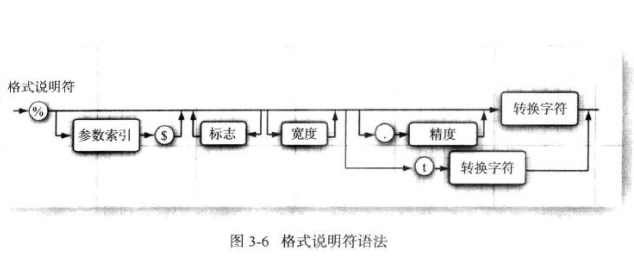

### 第三章 Java 的基本程序设计结构

   
    
#### 3.1 FirstSample 
         
    
#### 3.2 注解

    
#### 3.3 数据类型

##### 3.3.1 整型 
   
|类型|存储需求|取值范围|
|-|-|-|
|int|4个字节|-2147483648 ~ 2147483647（正好超过20亿）|
|short|2个字节|-32768 ~ 32767|
|long|8个字节|-9223372036854775808 ~ 9223372036854775807|
|short|1个字节|-128 ~ 127|
    
    在Java中，整型的范围与运行Java代码的机器无关。
    
    长整形数值有一个后缀L， 十六进制数值有一个前缀0x. 八进制有一个前缀0,X显然八进制表示法比较容易混淆，
    建议最好不要使用八进制常数。 从Java7，加上前缀0b就可以写二进制数。同样从java7 开始，还可以为数字
    字面量加下划线，如：1_000_000 表示一百万。这些下划线只是为了让人更易读。Java编译器会除去这些下划线。
    
##### 3.3.2 浮点类型

|类型|存储需求|取值范围|
|-|-|-|
|float|4个字节|大约 +- 3.40282347E+38F (有效位数为6-7位)|
|double|8个字节|大约 +- 1.79769313486231570E+308 (有效位数为15位)|
    
    绝大多数应用程序都采用double类型，很多情况下，float类型的精度很难满足需求。
    实际上，只有很少的情况适合使用float类型，如：需要快速地处理单精度数据，或需要存储大量数据。
    float类型的数值有一个后缀F。没有后缀F的浮点数值默认为double类型。
    
    表示溢出和出错情况的是三个特殊的浮点数值。
    正无穷大
    负无穷大 
    NaN （不是一个数字）
    
    浮点数值不适用于禁止出现舍入误差的金融计算中。如果需要计算中不包含有任何舍入误差，就应该使用BigDecimal类。
    
##### 3.3.3 char类型
    
    char类型表示单个字符。我们强烈建议不要在程序中使用char类型。
    
    在java中，char类型用UTF-16编码描述一个代码单元。
    
##### 3.3.4 boolean类型    
    
    boolean （布尔）类型有两个值：false和true，用来判定逻辑条件。
    
    
    
#### 3.4 变量

    在Java中， 每一个变量属于一种类型（type）
    
    变量名中所有的字符都是有意义的，并且大小写铭感，变量名的长度没有限制。
    
    尽管$是一个合法的Java字符，但不要在你自己的代码中使用这个字母。它只用在Java编译器或者其他工具生成的名字中。
    

##### 3.4.2 常量

    在Java中，利用关键字final指示常量。
    
    关键字final表示这个变量只能被赋值一次，一旦被赋值之后，就不能再更改了。习惯上，常量名使用大写。
    
    

#### 3.5 运算符
    
    可移植性是JAVA语言的设计目标之一。无论在哪个虚拟机上运行，同一运算应该得到同样的结果。
    对于浮点数的算术运算，实现这样的可移植性是相当困难的。double类型使用64位存储一个double数值，
    而有些处理器使用80位浮点寄存器。执行寄存器增加了中间过程的计算精度。
    
    在默认情况下，虚拟机设计者允许将中间计算结果采用扩展的精度。但是对于使用了strictfp关键字标记的
    方法必须使用严格的浮点计算来产生理想的结果。
    
    默认的方式不会产生溢出，而采用严格的计算有可能产生溢出。

##### 3.5.1 自增与自减
    
    这个运算符有两种形式。一是“后缀”形式，还有一种“前缀”形式。在表达式中，两种形式就有区别了。
    前缀方式先进行加1运算；后缀方式则使用变量原来的值。
    
    我们建议不要在其他表达式的内部使用自增或自减，这样编写的代码很容易令人困惑，并产生bug。
    
##### 3.5.2 关系运算符与boolean 运算符

    && 表示逻辑“与”， 简洁与即当第一个表达式值为false，结果不可能为真。
    因此，第二个表达式的值就没有必要计算了。
    
    || 表示逻辑“或”， 简洁或即当第一个表达式值为true，结果自动为true。
                  因此，不必再计算第二部分。
    !  表示逻辑“非”
    
    java支持三元操作符 ? : 
    
##### 3.5.3 位运算符

    在处理整型数值时，可以直接对组成整型数值的各个位进行操作。
    
    & （“与”）， | （“或”）， ^ （“异或”），~（“非”）
    
    &和| 运算符应用于布尔值，得到的结果也是布尔值。这两个元素与&&和||的运算符非常类似，
    只是不按“短路”方式计算。
    
    另外，“>>”和“<<”运算符将二进制进行右移或左移操作。最后,“>>>”运算符将0填充高位；
    “>>”运算符用符号位填充高位。没有“<<<”运算符。
    
##### 3.5.4 数学函数与常量

    在Math类中，包含了各种各样的数学函数。
    在Math类中，为了达到最快的性能。所有的方法都是使用计算机浮点单元中的例程。如果得到一个
    完全可预测的结果比运行速度更重要的话，那么就应该使用StrictMath类。
    
    
##### 3.5.5 数值类型之间的转换
    
   
    
    图中6个实心箭头，表示无信息丢失的转换；有3个虚线箭头，表示可能存在精度损失的转换。
    
    如果两个操作数有个是double类型，另一个操作就会转换成double类型。
    否则，如果一个操作数是float类型，另一个操作数将会转换为float类型。
    否则，如果一个操作数是long类型，另一个操作数将转换成long类型。
    否则，两个操作数都将被转换为int类型。
    

##### 3.5.6 强制类型转换
    
    强制类型转换的语法是在圆括号中给出想要转换的目标类型，后面紧跟待转换的变量名。
    
    强制类型转换通过截断小数部分将浮点值转换为整型。
    
    如果试图将一个数值从一种类型强制转换为另一种类型，而又超出了目标类型的表示范围，
    结果就会截断成一个完全不同的值。
    
##### 3.5.7 括号与运算符级别

|运算符|结合性|
|-|-|
|[] . (){方法调用}|从左向右|
|! ~ ++ -- +{一元运算} -{一元运算} (){强制类型转换} new|从右向左|
|* / %|从左向右|
|+ -|从左向右|
|<< >> >>>|从左向右|
|< <= > >= instanceof|从左向右|
|== !=|从左向右|
|&|从左向右|
|^|从左向右|
|||从左向右|
|&&|从左向右|
||||从左向右|
|? :|从右向左|
|= += -= *= /= %= &= |= ^= <<= >>= >>>=|从右向左|

##### 3.5.8 枚举类型

    变量的取值只在一个有限的集合内。针对这种情况，可以自定义枚举类型。枚举类型包括有限个命名的值。
    如：enum Size{SMALL,MEDIUM, LARGE, EXTRA_LARGE},声明变量：Size s = Size.MEDIUM;Size类型的变量
    只能存储这个类型声明中给定的某个枚举值，或null值，null表示这个变量没有设置任何值。

#### 3.6 字符串

    java字符串就是Unicode字符序列。
    
##### 3.6.3 不可变字符串

    由于不能修改Java字符串中的字符，所以在Java文档中将String 类对象称为不可变字符串。
    当然，可以修改字符串变量，让它引用另外一个字符串。
    不可变的字符串却有一个优点：编译器可以让字符串共享。

##### 3.6.4 检测字符串是否相等
    
    一点不能使用 == 运算符检测两个字符串是否相等！这个运算符只能确定两个字符串是否放置在同一个位置上。
    
##### 3.6.5 空串与Null串
   
    空串是一个java对象，有自己的串长度（0）和内容（空）。String变量可以存放一个特殊的值，null。
    检查一个字符串是否为null， if(str == null)
    检查一个字符串既不是null，也不是空串， if(str != null && str.length() != 0)
    
##### 3.6.6 代码点和代码单元
    
     Char： 在java中是采用UTF-16编码的，也就是说，Char是代表一个字符单元。
     代码单元：UTF-8中是用8个字节表示的，UTF-16中使用16个字节表示的等等。
     代码点：对应各种真正字符（char不是真正的字符，是代码单元）的Unicode编码。
    
     String test = "Hello";
     长度： 
            test.Length();   //返回代码单元的数量
            test.codePointCount(0,test.Length());//0-length单元之间，返回代码点的数量
     字符：
            test.charAt(i);  //返回第i个代码单元
            Int index = test.offByCodePoint(0,i); //返回第i个代码点的专用索引
            test.codePointAt(index);             //返回第i个代码点
     遍历字符串真正字符：
            Int cp = test.codePointAt(i);
            If(Character.isSupplementaryCodePoint(cp)) i += 2;  //判断是否是辅助字符
            Else i++;
   
   
 ##### 3.6.9 构建字符串
 
     如果需要用许多小段的字符串构建一个字符串，那么就可以使用StringBuilder
     StringBuilder builder = new StringBuilder();
   
#### 3.7 输入输出
   
##### 3.7.1 读取输入

     要想通过控制台进行输入，首先需要构造一个Scanner对象，并与“标准输入流”System.in 关联。
     Scanner in =  new Scanner(System.in);
     
##### 3.7.2 格式化输出     

    java沿用了C语言库函数中的printf方法。
    
**用于printf的转换符** 

|转换符|类型|说明|
|-|-|-|
|d|十进制整数|结果被格式化为十进制整数|
|x，X|十六进制整数|结果被格式化为十六进制整数|
|o|八进制整数|结果被格式化为八进制整数 |
|f|定点浮点数|结果被格式化为十进制数|
|e，E|指数浮点数|结果被格式化为用计算机科学记数法表示的十进制数 |
|g, G|通用浮点数|根据精度和舍入运算后的值，使用计算机科学记数形式或十进制格式对结果进行格式化。|
|a, A|十六进制浮点数|结果被格式化为带有效位数和指数的十六进制浮点数|
|s，S|字符串|如果参数 arg 为 null，则结果为 "null"。如果 arg 实现 Formattable，则调用 arg.formatTo。否则，结果为调用 arg.toString() 得到的结果。|
|c，C|字符|结果是一个 Unicode 字符|
|b，B|布尔|如果参数 arg 为 null，则结果为 "false"。如果 arg 是一个 boolean 值或 Boolean，则结果为 String.valueOf() 返回的字符串。否则结果为 "true"。 |
|h，H|散列码|如果参数 arg 为 null，则结果为 "null"。否则，结果为调用 Integer.toHexString(arg.hashCode()) 得到的结果。|
|t, T|日期时间|日期和时间转换字符的前缀|
|%|百分号| 结果为字面值 '%'|
|n|与平台有关的行分隔符|结果为特定于平台的行分隔符|
       
**用于printf的标志** 

|标志|目的|举例|
|-|-|-|
|+|打印正数和负数符号|+3333.33|
|空格|在正数之前添加空格| 3333.33|
|0|数字前面补0|003333.33|
|-|左对齐|3333.33 |
|(|将负数括在括号内|(3333.33)|
|,|添加分组分隔符|3,333.33|
|#（对于f格式）|包含小数点|3,333.|
|#（对于x或0格式）|添加前缀0x或0|0xCAFE|
|$|给定被格式化的参数索引, 如%1$d, %1$x 将以十进制和十六进制格式打印第一个参数 |159 9F|
|<|格式化前面说明的数值， 如:%d%<x 以十进制和十六进制打印同一个数值 |159 9F|

**日期和时间的转换符** 

|标志|目的|
|-|-|
|c|日期和时间，被格式化为 "%ta %tb %td %tT %tZ %tY"|
|F|ISO 8601 格式的完整日期，被格式化为 "%tY-%tm-%td"|
|D|日期，被格式化为 "%tm/%td/%ty|
|r|12 小时制的时间，被格式化为 "%tI:%tM:%tS %Tp"。上午或下午标记 ('%Tp') 的位置可能与语言环境有关|
|T|24 小时制的时间，被格式化为 "%tH:%tM:%tS"|
|R|24 小时制的时间，被格式化为 "%tH:%tM"|
|B|特定于语言环境的月份全称，例如 "January" 和 "February"。 |
|b，h|定于语言环境的月份简称，例如 "Jan" 和 "Feb"。 |
|A|特定于语言环境的星期几全称，例如 "Sunday" 和 "Monday"|
|a|特定于语言环境的星期几简称，例如 "Sun" 和 "Mon"|
|C|除以 100 的四位数表示的年份，被格式化为必要时带前导零的两位数，即 00 - 99 |
|Y|年份，被格式化为必要时带前导零的四位数（至少），例如，0092 等于格里高利历的 92 CE |
|y|年份的最后两位数，被格式化为必要时带前导零的两位数，即 00 - 99|
|j|一年中的天数，被格式化为必要时带前导零的三位数，例如，对于格里高利历是 001 - 366|
|m|月份，被格式化为必要时带前导零的两位数，即 01 - 13|
|d|一个月中的天数，被格式化为必要时带前导零两位数，即 01 - 31 |
|e|一个月中的天数，被格式化为两位数，即 1 - 31|
|H|24 小时制的小时，被格式化为必要时带前导零的两位数，即 00 - 23|
|I|12 小时制的小时，被格式化为必要时带前导零的两位数，即 01 - 12 |
|k|24 小时制的小时，即 0 - 23|
|l|12 小时制的小时，即 1 - 12|
|M|小时中的分钟，被格式化为必要时带前导零的两位数，即 00 - 59。 |
|S|分钟中的秒，被格式化为必要时带前导零的两位数，即 00 - 60 （"60" 是支持闰秒所需的一个特殊值）。 |
|L|秒中的毫秒，被格式化为必要时带前导零的三位数，即 000 - 999。|
|N|秒中的毫微秒，被格式化为必要时带前导零的九位数，即 000000000 - 999999999|
|p|特定于语言环境的 上午或下午 标记以小写形式表示，例如 "am" 或 "pm"。使用转换前缀 'T' 可以强行将此输出转换为大写形式|
|z|相对于 GMT 的 RFC 822 格式的数字时区偏移量，例如 -0800|
|Z|表示时区缩写形式的字符串。Formatter 的语言环境将取代参数的语言环境（如果有）。  |
|s|自协调世界时 (UTC) 1970 年 1 月 1 日 00:00:00 至现在所经过的秒数，即 Long.MIN_VALUE/1000 与 Long.MAX_VALUE/1000 之间的差值。 |
|Q|自协调世界时 (UTC) 1970 年 1 月 1 日 00:00:00 至现在所经过的毫秒数，即 Long.MIN_VALUE 与 Long.MAX_VALUE 之间的差值|

   
   
   
##### 3.7.3 文件输入与输出
   
    要想对文件进行读取，就需要用一个File对象构造一个Scanner对象。
    如果用一个不存在的文件构造一个Scanner对象，那么就会发生异常
    
    要想写入文件，就需要构造一个PrintWriter对象.如果文件不存在，创建该文件。
    如果一个不能被创建的文件名构造一个PrintWriter对象，那么就会发生异常
    
#### 3.8 控制流程

##### 3.8.1 块作用域

    块（即复合语句）是指由一个花括号括起来的若干条简单的java语句。块确定了变量的作用域。
    一个块可以嵌套在另一个块中。但是，不能在嵌套的两个块中声明同名的变量。
    
##### 3.8.2 条件语句语法
    
    if(condition)statement
    if(condition)statement1 else statement2
    
##### 3.8.3 循环语句语法

    while(condition)statement
    do statement while(condition)
    
##### 3.8.4 确定循环

    for语句的3个部分应该对同一个计数器变量进行初始化，检测和更新。若不遵守这一规则，编写的循环常常晦涩难懂。
    
##### 3.8.5 多重选择：switch语句

    switch 语句将从选项值相匹配的case标签处开始执行直到遇到break语句。或者执行到swich语句的结束处为止。
    
    case标签可以是：
    类型为char，byte， short或int(或其包装类Character, Byte, Short和Integer
    枚举常量
    从JavaSE 7开始。case标签还可以是字符串字面量。
    
##### 3.8.6 中断控制流程语句

    不带标签的break语句，用于跳出当前循环，java还提供了一种带标签的break语句，用于跳出多重嵌套的循环语句。
    注意，标签必须放在希望跳出的最外层循环之前，并且必须紧跟一个冒号。
    
    还有一个continue语句，与break一样，它将中断正常的控制流程。continue语句将控制循环转移到最内层循环的首部。
    
#### 3.9 大数值

    BigInteger类实现了任意精度的整数运算,BigDecimal实现了任意精度的浮点数运算。
    
#### 3.10 数组

    数组是一种数据结构，用来存储同一类型值的集合。通过一个整型下标就可以访问数组中的每一个值。
    一旦创建了数组，就不能再改变它的大小（尽管可以改变每一个数组元素）。
    
##### 3.10.1 for each 循环语法

    for(varibale:collection) statement
    
    打印数组中的所有的值，即利用Arrays类的toString方法。Arrays.toString(a);
    
##### 3.10.3 数组拷贝
    
    Arrays类的copyTo方法
    
##### 3.10.5 数组排序
    
    Arrays类的sort方法
    
##### 3.10.6 多维数组

    多维数组将使用多个下标访问数组元素，它适用于表示表格或更加复杂的排序形式。

    
##### 3.10.7 不规则数组
    
    Java实际上没有多维数组， 只有一位数组。多维数组被解释为“数组的数组”。“不规则”数组，即数组的每一行有不同的长度。
    

