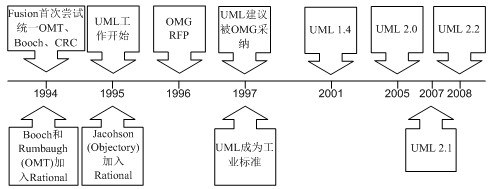

### 第一章 UML 概述

       
    UML是一种获取了国际双标准的图形语言，专门用来表达OOAD(Object-Oriented Analysis and Design)的生成。
    这句话包含了UML的四项特色：
    1）UML是一种语言，不是一种方法
    2）UML是图形语言，不是编程语言，也不是自然语言。
    3）UML通过了两项国际标准
    4）UML深具面向对象（Object-Oriented）色彩
       
#### 1.1 语言与方法

    面向对象程序设计（简称OOP)是当今主流的程序设计范型，它已经取代了20世纪70年代的“结构化”过程化程序
    设计开发技术。java是完全面向对象的。
    
    面向对象的程序是由对象组成的，每个对象包对用户公开的特定的功能部分和隐藏的实现部分。程序中的很多
    对象来自标准库，还有一些是自定义的。从根本上说，只要对象能够满足要求，就不必关心其功能的具体实现过程。
    在OOP中，不必关心对象的具体实现，只要能够满足用户的需求即可。
    
    
    传统的结构化程序设计通过设计一系列的过程（即算法）来解决问题。一旦确定了这些过程，就要开始考虑
    存储数据的方式。这就是Pascal语言的设计者Niklaus Wirth 将其著作命名为《算法+数据结构=程序》（Algorithms+
    Data Structures = Programs， Prentice Hall 1975）的原因。在Wirth命名的书名中，算法是第一位的，数据
    结构是第二位的，这就明确地表述了程序员的工作方式，首页要确定如何操作数据，然后再决定如何组织数据，以便于
    数据操作。而OOP却调换了这个次序，将数据放在第一位，然后再考虑操作数据的算法。
    
    对于一些规模较小的问题，将其分解为过程的开发方式比较理想。而面向对象更加适用于解决规模较大的问题。
    
   
